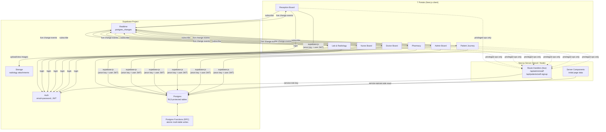
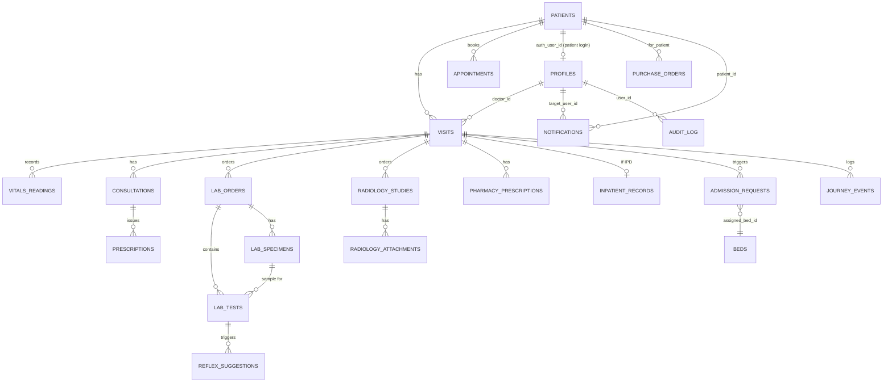
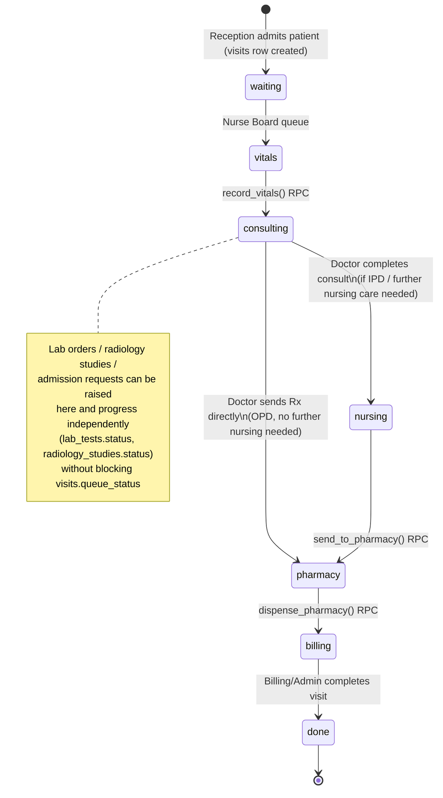
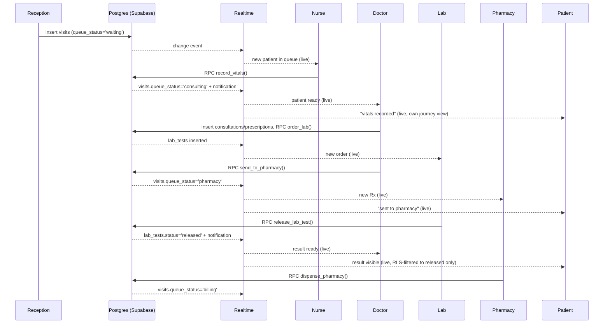

# Umang HIMS — Backend Architecture & Database Design (7-Portal Core)

**Date:** 2026-07-03
**Status:** Draft — pending your review and approval. No implementation has started.
**Scope:** Patient Journey (patient-facing), Doctor Board, Admin Board, Nurse Board, Reception Board, Lab & Radiology, Pharmacy. The other 20+ existing frontend modules (billing, HR, CMO/secretary cockpits, bloodbank, OT, etc.) are explicitly out of scope and continue running on local mock data until you request them.

---

## 1. Executive Summary

Today every one of the app's 70+ Zustand stores persists to `localStorage`, with hand-rolled cross-tab merge logic (see `useLabOrdersStore`'s `mergeOrders`/`mergeTests`) standing in for a real backend. There is no database, no real authentication (just a role-switcher), and no server.

The recommended architecture is **Supabase-native**: Postgres + Auth + Realtime + Storage, accessed directly from the browser via `supabase-js`, with **Row-Level Security (RLS)** as the authorization boundary instead of a hand-built REST API. A small, typed repository layer already exists in the codebase (`src/lib/api/`, currently localStorage-backed) that was explicitly designed for this swap — its comment reads *"Phase-2 swap is a transport change, not an API change."* We reuse and extend it rather than building a parallel system.

A handful of Next.js Route Handlers exist only where the service-role key or an atomic multi-table write is required. Everything else — reads, writes, live updates — goes straight from a portal to Postgres, filtered by RLS, pushed live by Realtime.

The entire patient journey is **status-driven, never destructive**: no row is ever moved or deleted when a patient progresses between portals. Every table that represents a stage of care is append/update-only; a portal's "queue" is just a filtered view (`WHERE status = ...`), and a portal's "history" is a different filter on the same rows. This satisfies the requirement that a patient never disappears from a portal that has already touched them.

---

## 2. System Architecture



**Why no custom REST server for standard CRUD:** RLS enforces "a nurse can only update vitals," "a pharmacist can't see billing," etc. at the database layer, for every client, with no way to bypass it by hitting the wrong endpoint. Writing the same authorization logic again in Next.js routes would double the code and create two places it can drift out of sync.

**Where a Route Handler is still used:** anything requiring the service-role key (which must never reach the browser) — creating staff logins — or an operation better expressed as a single guarded transaction than a raw table write.

---

## 3. Database Architecture

- **Engine:** Supabase Postgres (single project, single hospital — no `tenant_id` needed given your confirmed single-facility scope; add it later only if multi-hospital becomes real).
- **Connection strategy:** Next.js on Vercel runs as serverless/edge functions, which open/close connections per invocation — this is exactly the failure mode connection pools break under. Use **Supavisor (Supabase's pooler) in transaction mode** for all server-side connections; the browser client uses the REST/Realtime interface, not raw Postgres connections, so this only matters for the few Route Handlers.
- **IDs:** keep the existing human-readable prefixed text IDs already established in the codebase's `src/lib/api` zod schemas (`PT-...`, `LO-...`, `RS-...`) rather than switching to UUIDs — avoids churn in the large surface of code that already prints/matches these. Exception: `profiles.id`, which **must** equal `auth.users.id` (a UUID, Supabase's requirement).
- **Timestamps:** `timestamptz` everywhere, defaulting to `now()`. No naive timestamps.
- **Enums:** Postgres native `enum` types for small, stable status sets (queue status, roles, lab test status). Avoids typos that a `text` column would silently accept.
- **Soft delete:** only on `patients` (`deleted_at`, for DISHA/consent right-to-be-forgotten, mirroring the existing zod schema's `deletedAt` field). Every other table is append/update-only by design — see §12.
- **Rich/variable nested data:** stored as `jsonb` (lab analytes, radiology AI findings, IPD clinical record) rather than exploded into many extra tables — see §4 rationale per table. This is the main lever keeping the schema "minimal but powerful": ~23 tables cover 7 portals' worth of workflow instead of 60+.

---

## 4. Complete Database Schema

Below is full DDL-level detail: columns, types, constraints, primary/foreign keys. Indexes are called out per table; the consolidated indexing rationale is in §13.

```sql
-- ── Identity ────────────────────────────────────────────────────────────

create type role_t as enum (
  'doctor','nurse','pharmacy','lab','radiology',
  'reception','admin','patient'
);

create table profiles (
  id              uuid primary key references auth.users(id) on delete cascade,
  role            role_t not null,
  full_name       text not null,
  department      text,
  specialization  text,
  phone           text,
  is_active       boolean not null default true,
  created_at      timestamptz not null default now()
);
create index profiles_role_idx on profiles(role);

-- ── Patients ────────────────────────────────────────────────────────────

create type sex_t as enum ('Male','Female','Other');
create type payer_t as enum ('cash','corporate','insurance','govt');

create table patients (
  id                  text primary key,              -- 'PT-XXXXX'
  hn                  text unique not null,           -- Hospital Number
  auth_user_id        uuid unique references auth.users(id),  -- null until patient self-registers/logs in
  full_name           text not null,
  phone               text not null,
  dob                 date,
  age                 smallint,
  sex                 sex_t not null,
  blood_group         text,
  primary_payer       payer_t not null default 'cash',
  insurer_name        text,
  address             text,
  allergies           text[] not null default '{}',
  chronic_conditions  text[] not null default '{}',
  family_contacts     jsonb not null default '[]',    -- [{name, relation, phone}]
  disha_consent_at    timestamptz,
  created_at          timestamptz not null default now(),
  updated_at          timestamptz not null default now(),
  deleted_at          timestamptz
);
create index patients_phone_idx on patients(phone);
create unique index patients_hn_idx on patients(hn);

-- ── Visits (one row per OPD/IPD/ER episode — the workflow spine) ─────────

create type visit_type_t as enum ('OPD','IPD','ER');
create type queue_status_t as enum
  ('waiting','vitals','consulting','nursing','pharmacy','billing','done');
create type triage_t as enum ('Low','Medium','High','Critical');

create table visits (
  id               text primary key,                 -- 'V-...'
  patient_id       text not null references patients(id),
  visit_type       visit_type_t not null default 'OPD',
  department       text not null,
  doctor_id        uuid references profiles(id),
  token            integer,
  queue_status     queue_status_t not null default 'waiting',
  triage_level     triage_t default 'Low',
  symptoms         text[] not null default '{}',
  ward_bed         text,                              -- promoted from inpatient_records for cheap cross-portal reads
  registered_at    timestamptz not null default now(),
  registered_by    uuid references profiles(id),
  discharged_at    timestamptz
);
create index visits_patient_idx on visits(patient_id);
create index visits_doctor_active_idx on visits(doctor_id, queue_status)
  where queue_status <> 'done';
create index visits_queue_status_idx on visits(queue_status)
  where queue_status <> 'done';   -- partial index: only the active queue is ever scanned by portals

-- ── Vitals (multiple readings per visit → trend charts) ──────────────────

create table vitals_readings (
  id           bigint generated always as identity primary key,
  visit_id     text not null references visits(id),
  recorded_by  uuid not null references profiles(id),
  recorded_at  timestamptz not null default now(),
  payload      jsonb not null   -- {bp, temp, hr, spo2, rr, weight, pain, gcs, ...} — matches existing VitalsRecord shape
);
create index vitals_visit_idx on vitals_readings(visit_id, recorded_at desc);

-- ── Appointments ───────────────────────────────────────────────────────

create type appt_status_t as enum ('upcoming','confirmed','cancelled','completed');
create type appt_mode_t as enum ('online','in_person');

create table appointments (
  id           text primary key,                     -- 'APT-...'
  patient_id   text not null references patients(id),
  doctor_id    uuid not null references profiles(id),
  specialty    text not null,
  date         date not null,
  time         text not null,
  mode         appt_mode_t not null default 'in_person',
  status       appt_status_t not null default 'upcoming'
);
create index appointments_doctor_date_idx on appointments(doctor_id, date);
create index appointments_patient_idx on appointments(patient_id);

-- ── Doctor consultation ───────────────────────────────────────────────

create table consultations (
  id          text primary key,                       -- 'CN-...'
  visit_id    text not null references visits(id),
  doctor_id   uuid not null references profiles(id),
  notes       text,
  diagnosis   text,
  created_at  timestamptz not null default now()
);
create index consultations_visit_idx on consultations(visit_id);

create table prescriptions (
  id                text primary key,                 -- 'RX-...'
  consultation_id   text not null references consultations(id),
  patient_id        text not null references patients(id),
  medicine          text not null,
  dosage            text not null,
  duration          text not null,
  instructions      text,
  created_at        timestamptz not null default now()
);
create index prescriptions_consultation_idx on prescriptions(consultation_id);
create index prescriptions_patient_idx on prescriptions(patient_id);

-- ── Lab ────────────────────────────────────────────────────────────────

create type lab_source_t as enum ('OPD','IPD','ICU','OT','ER');
create type payment_mode_t as enum ('Cash','UPI','Card','Insurance','Credit');
create type lab_test_status_t as enum
  ('awaiting_collection','collected','on_bench','in_progress',
   'entered','verified','released','rejected','recollect_requested');

create table lab_orders (
  id              text primary key,                   -- 'LO-...'
  visit_id        text not null references visits(id),
  patient_id      text not null references patients(id),
  doctor_id       uuid references profiles(id),
  source          lab_source_t not null,
  ward_bed        text,
  payment_mode    payment_mode_t not null,
  fasting_status  text,
  clinical_notes  text,
  ordered_at      timestamptz not null default now()
);
create index lab_orders_visit_idx on lab_orders(visit_id);
create index lab_orders_patient_idx on lab_orders(patient_id);

create table lab_specimens (
  id              text primary key,                   -- accession number, e.g. 'ACC-1042'
  order_id        text not null references lab_orders(id),
  type            text not null,
  container       text not null,
  collected_by    uuid references profiles(id),
  collected_at    timestamptz,
  reject_reason   text
);
create index lab_specimens_order_idx on lab_specimens(order_id);

create table lab_tests (
  id                text primary key,                 -- 'LT-...'
  order_id          text not null references lab_orders(id),
  specimen_id       text references lab_specimens(id),
  code              text not null,
  name              text not null,
  bench             text not null,
  priority          text not null default 'Routine',
  status            lab_test_status_t not null default 'awaiting_collection',
  assigned_to       uuid references profiles(id),
  entered_by        uuid references profiles(id),
  verified_by       uuid references profiles(id),
  expected_tat_min  integer not null,
  ordered_at        timestamptz not null default now(),
  released_at       timestamptz,
  analytes          jsonb not null default '[]',   -- [{analyte, value, unit, refLow, refHigh, flag}] — variable per test code
  micro             jsonb,                          -- microbiology phase/organisms/AST — only populated for culture tests
  callback          jsonb,                          -- critical-value callback record
  updated_at        timestamptz not null default now()
);
create index lab_tests_order_idx on lab_tests(order_id);
create index lab_tests_active_idx on lab_tests(status)
  where status not in ('released','rejected');   -- bench/pathologist worklists only ever query the active set
create index lab_tests_assigned_idx on lab_tests(assigned_to) where assigned_to is not null;

create table reflex_suggestions (
  id               text primary key,
  based_on_test_id text not null references lab_tests(id),
  code             text not null,
  reason           text not null,
  ordered_at       timestamptz,
  created_at       timestamptz not null default now()
);

-- ── Radiology ──────────────────────────────────────────────────────────

create type rad_status_t as enum
  ('ordered','scheduled','arrived','acquiring','acquired',
   'reading','reported','verified','released','cancelled');

create table radiology_studies (
  id                text primary key,                 -- 'RS-...'
  visit_id          text not null references visits(id),
  patient_id        text not null references patients(id),
  doctor_id         uuid references profiles(id),
  source            lab_source_t not null,
  modality          text not null,
  body_part         text not null,
  priority          text not null default 'Routine',
  status            rad_status_t not null default 'ordered',
  scheduled_for     timestamptz,
  report_sections   jsonb not null default '{}',      -- {findings, impression, technique, ...}
  ai_findings       jsonb,
  dose_record       jsonb,
  reading_by        uuid references profiles(id),
  verified_by       uuid references profiles(id),
  expected_tat_min  integer not null,
  ordered_at        timestamptz not null default now(),
  released_at       timestamptz,
  updated_at        timestamptz not null default now()
);
create index rad_studies_visit_idx on radiology_studies(visit_id);
create index rad_studies_active_idx on radiology_studies(status)
  where status not in ('released','cancelled');

create table radiology_attachments (
  id            text primary key,
  study_id      text not null references radiology_studies(id),
  storage_path  text not null,     -- Supabase Storage object path, not the file itself
  caption       text,
  uploaded_by   uuid references profiles(id),
  uploaded_at   timestamptz not null default now()
);
create index rad_attachments_study_idx on radiology_attachments(study_id);

-- ── Pharmacy ───────────────────────────────────────────────────────────

create type rx_status_t as enum ('queued','preparing','ready','collected');

create table pharmacy_prescriptions (
  id             text primary key,                    -- 'PX-...'
  visit_id       text not null references visits(id),
  patient_id     text not null references patients(id),
  doctor_id      uuid references profiles(id),
  department     text,
  source         text,
  payment_mode   payment_mode_t,
  status         rx_status_t not null default 'queued',
  medicines      jsonb not null default '[]',   -- [{name, dosage, frequency, duration, quantity, substitutedFrom?}]
  assigned_to    uuid references profiles(id),
  dispatched_at  timestamptz,
  collected_by   text,
  collected_at   timestamptz,
  created_at     timestamptz not null default now()
);
create index pharmacy_rx_visit_idx on pharmacy_prescriptions(visit_id);
create index pharmacy_rx_active_idx on pharmacy_prescriptions(status)
  where status <> 'collected';

create table pharmacy_inventory (
  id          text primary key,
  name        text not null,
  category    text not null,
  qty         integer not null default 0,
  unit        text not null,
  reorder_at  integer not null,
  max_stock   integer not null,
  schedule    text
);
create index pharmacy_inventory_low_stock_idx on pharmacy_inventory(qty) where qty <= reorder_at;

create type po_status_t as enum ('pending','ordered','received');

create table purchase_orders (
  id           text primary key,
  drug         text not null,
  qty          integer not null,
  kind         text not null,          -- 'patient' | 'restock'
  for_patient  text references patients(id),
  raised_by    uuid references profiles(id),
  status       po_status_t not null default 'pending',
  raised_at    timestamptz not null default now()
);

-- ── Admission / beds ──────────────────────────────────────────────────

create type bed_status_t as enum ('available','occupied','cleaning','blocked');

create table beds (
  id            text primary key,
  bed_number    text not null,
  ward          text not null,
  floor         text,
  status        bed_status_t not null default 'available',
  occupant_id   text references patients(id),
  updated_at    timestamptz not null default now()
);
create index beds_status_idx on beds(status);

create type admission_status_t as enum
  ('requested','bed_assigned','admitted','cancelled');

create table admission_requests (
  id                  text primary key,
  visit_id            text not null references visits(id),
  patient_id          text not null references patients(id),
  diagnosis           text,
  admission_type      text not null,
  bed_type_preference text,
  reason              text,
  requested_by        uuid references profiles(id),
  department           text,
  payer_type          payer_t,
  status              admission_status_t not null default 'requested',
  assigned_bed_id     text references beds(id),
  requested_at        timestamptz not null default now()
);
create index admission_requests_active_idx on admission_requests(status)
  where status not in ('admitted','cancelled');

-- ── Inpatient clinical record (nurse/doctor IPD workspace) ────────────

create table inpatient_records (
  visit_id        text primary key references visits(id),
  condition       text,
  clinical_record jsonb not null default '{}',  -- rounds, med orders, progress notes, IV lines, I/O, discharge pillars
  updated_at      timestamptz not null default now()
);

create table nurse_tasks (
  id          text primary key,
  visit_id    text references visits(id),
  title       text not null,
  category    text not null,
  priority    text not null default 'medium',
  source      text not null default 'manual',
  done        boolean not null default false,
  created_at  timestamptz not null default now(),
  done_at     timestamptz
);
create index nurse_tasks_open_idx on nurse_tasks(done) where done = false;

-- ── Cross-cutting ──────────────────────────────────────────────────────

create table notifications (
  id             bigint generated always as identity primary key,
  type           text not null,
  priority       text not null default 'medium',
  title          text not null,
  body           text not null,
  target_role    role_t,
  target_user_id uuid references profiles(id),
  patient_id     text references patients(id),
  read           boolean not null default false,
  created_at     timestamptz not null default now()
);
create index notifications_unread_idx on notifications(target_user_id, read) where read = false;
create index notifications_role_unread_idx on notifications(target_role, read) where read = false;

-- Append-only, system-wide security/compliance audit (logins, staff changes, every mutation).
create table audit_log (
  id           bigint generated always as identity primary key,
  user_id      uuid references profiles(id),
  user_name    text,
  action       text not null,
  resource     text not null,
  resource_id  text,
  detail       text,
  before       jsonb,
  after        jsonb,
  created_at   timestamptz not null default now()
);
create index audit_log_resource_idx on audit_log(resource, resource_id);
create index audit_log_created_idx on audit_log(created_at desc);
-- No UPDATE/DELETE policy is ever granted on this table — enforced at RLS level (§9).

-- Append-only, patient-journey-specific timeline (powers the Patient Journey portal
-- and "complete audit trail of the patient's journey" requirement without scanning
-- the much larger, unrelated audit_log).
create table journey_events (
  id           bigint generated always as identity primary key,
  visit_id     text not null references visits(id),
  patient_id   text not null references patients(id),
  event_type   text not null,          -- 'admitted','vitals_recorded','consult_started','sent_to_pharmacy', ...
  from_status  text,
  to_status    text,
  actor_id     uuid references profiles(id),
  actor_role   role_t,
  note         text,
  occurred_at  timestamptz not null default now()
);
create index journey_events_visit_idx on journey_events(visit_id, occurred_at);
create index journey_events_patient_idx on journey_events(patient_id, occurred_at);
```

**Why `jsonb` for analytes/micro/report_sections/ai_findings/clinical_record instead of more tables:** these are (a) module-internal — no other portal ever queries "give me every patient with Troponin > X across all tests," they query by `lab_tests.status`/`visit_id` first and then read the whole row — and (b) shaped differently per test/study code, which in a fully normalized model would need either a sparse wide table or an EAV pattern, both worse than `jsonb` for this access pattern. If a future requirement needs to query *inside* these blobs at scale (e.g. "all abnormal CRP results this month"), Postgres supports `jsonb` GIN indexes without a schema rewrite — see §18.

---

## 5. Entity Relationship Diagram



---

## 6. Backend Folder Structure

```
supabase/
  migrations/                    -- one .sql file per schema change, timestamped, Supabase CLI-managed
  seed.sql                       -- demo data mirroring today's MOCK_* arrays
  config.toml

src/lib/supabase/
  client.ts                      -- browser client (anon key) — used by portals + stores
  server.ts                      -- server client for Route Handlers/RSC, cookie-based session via @supabase/ssr
  admin.ts                       -- service-role client — imported ONLY inside src/app/api/admin/**

src/lib/api/                     -- existing repository layer, extended
  _core.ts                       -- table() reimplemented against supabase-js instead of localStorage
  patients.ts / visits.ts / vitals.ts / appointments.ts
  consultations.ts / prescriptions.ts
  lab.ts (orders + tests + specimens + reflex)
  radiology.ts (studies + attachments)
  pharmacy.ts (prescriptions + inventory + purchase orders)
  admission.ts (beds + admission_requests)
  inpatient.ts / nurse-tasks.ts
  notifications.ts / audit.ts / journey.ts
  rpc.ts                         -- typed wrappers around the Postgres functions in §8

src/lib/realtime/
  subscribe.ts                   -- one shared helper: subscribe(table, filter, onChange) → cleanup fn
                                     used by each store to replace the localStorage 'storage' event listener

src/app/api/
  admin/staff/route.ts           -- POST — create staff login (service-role)
  patients/self-signup/route.ts  -- POST — patient self-registration with phone dedup

src/store/                       -- existing stores; internals swap from local-only set() to:
                                     optimistic set() + await src/lib/api call + Realtime keeps other tabs in sync
```

---

## 7. API Architecture

Three tiers, in order of how much traffic each carries:

1. **Direct table access (majority of all reads/writes).** A portal calls `src/lib/api/<domain>.ts`, which calls `supabase.from('<table>').select/insert/update(...)`. Authorization is enforced by RLS (§9), not by this code. This is the "endpoint" for the vast majority of the API list in §8.
2. **RPC (Postgres functions) for atomic multi-table writes.** Anything that must update more than one table in one transaction — releasing a lab result also writes `notifications` and `journey_events`; the same normal client call cannot guarantee atomicity across two separate `insert`s from JavaScript. Called via `supabase.rpc('function_name', {...})`.
3. **Route Handlers (2 total) for service-role-only operations.** Creating a staff login must use `auth.admin.createUser()`, which requires the service-role key — that key must never reach the browser, so it's the one thing that has to go through a Next.js server route.

**Client-side data layer:** recommend adding **TanStack Query** on top of `src/lib/api` calls. It gives request de-duplication, caching, and background refetch for free, which directly serves the "no redundant database calls" and "feels instant" requirements — without it, every portal navigation would refire the same queries. Realtime events invalidate the relevant query key instead of each store re-fetching independently.

---

## 8. Complete API Reference

Grouped by portal. "Endpoint" = table name + operation for tier-1 calls, or function name for RPC/Route Handlers. Request/response shapes are the JS object shapes passed to/from `supabase-js` (tier 1/2) or JSON body (tier 3).

### Reception Board

| Action | Tier | Endpoint | Request | Response | Responsibility |
|---|---|---|---|---|---|
| Register patient | 1 | insert `patients` | `{hn, full_name, phone, dob, sex, ...}` | `Patient` row | Create/find patient master record |
| Search patient by phone | 1 | select `patients` where phone | `{phone}` | `Patient[]` | Dedup before re-registering |
| Start a visit | 1 | insert `visits` | `{patient_id, department, doctor_id?, visit_type}` | `Visit` row (`queue_status='waiting'`) | Puts patient in the OPD queue |
| View today's queue | 1 | select `visits` where `queue_status <> 'done'` | `{department?}` | `Visit[]` | Reception board list |
| Book appointment | 1 | insert `appointments` | `{patient_id, doctor_id, date, time, mode}` | `Appointment` | Scheduling |
| Request admission | 1 | insert `admission_requests` | `{visit_id, diagnosis, admission_type, ...}` | `AdmissionRequest` | Kicks off bed assignment |

### Nurse Board

| Action | Tier | Endpoint | Request | Response | Responsibility |
|---|---|---|---|---|---|
| Active vitals queue | 1 | select `visits` where `queue_status='vitals'` | — | `Visit[]` | Worklist |
| Record vitals | 2 | RPC `record_vitals` | `{visit_id, payload}` | `{reading, visit}` | Insert reading + flip visit to `consulting` + notify doctor, atomically |
| My history (all patients I've touched) | 1 | select `vitals_readings` where `recorded_by=me` join `visits` | `{}` | `VitalsReading[]` | Historical view — never disappears even after visit progresses |
| Nurse task list | 1 | select `nurse_tasks` where `done=false` | — | `NurseTask[]` | Task board |
| Complete nursing task | 1 | update `nurse_tasks` | `{id, done:true}` | `NurseTask` | Close task |

### Doctor Board

| Action | Tier | Endpoint | Request | Response | Responsibility |
|---|---|---|---|---|---|
| My active queue | 1 | select `visits` where `doctor_id=me and queue_status='consulting'` | — | `Visit[]` | Worklist |
| Start consultation | 1 | insert `consultations` | `{visit_id, notes, diagnosis}` | `Consultation` | Clinical note |
| Add prescription | 1 | insert `prescriptions` | `{consultation_id, medicine, dosage, duration}` | `Prescription` | Rx line |
| Order lab test(s) | 2 | RPC `order_lab` | `{visit_id, test_codes[]}` | `LabOrder` + `LabTest[]` | Creates order + tests + specimens in one transaction |
| Order radiology study | 2 | RPC `order_radiology` | `{visit_id, modality, body_part}` | `RadiologyStudy` | Same pattern |
| Send to pharmacy | 2 | RPC `send_to_pharmacy` | `{visit_id, medicines[]}` | `PharmacyPrescription` | Creates Rx + flips `visits.queue_status='pharmacy'` + notifies pharmacy |
| My stats | 1 | select aggregate view (see §13) | `{period}` | `{opd, online, tests, prescriptions}` | Dashboard KPIs, from a pre-aggregated view, not a live join |

### Lab & Radiology

| Action | Tier | Endpoint | Request | Response | Responsibility |
|---|---|---|---|---|---|
| Active bench worklist | 1 | select `lab_tests` where `status not in ('released','rejected')` | `{bench?}` | `LabTest[]` | Worklist (partial index-backed) |
| Collect specimen | 1 | update `lab_specimens` + `lab_tests` | `{order_id, accession, collected_by}` | updated rows | Move to `on_bench` |
| Claim test | 1 | update `lab_tests` | `{id, assigned_to}` | `LabTest` | `on_bench → in_progress` |
| Enter result | 1 | update `lab_tests.analytes` | `{id, analyte, value}` | `LabTest` | Result entry |
| Release result | 2 | RPC `release_lab_test` | `{id, verified_by}` | `LabTest` | Update status + notify doctor + audit + journey_event, atomically; also evaluates reflex rules server-side |
| Radiology worklist | 1 | select `radiology_studies` where active | `{modality?}` | `RadiologyStudy[]` | Worklist |
| Upload attachment | 1 (+ Storage) | Storage upload, then insert `radiology_attachments` | file + `{study_id, caption}` | `Attachment` | Image capture |
| Verify & release study | 2 | RPC `verify_and_release_radiology` | `{id, verified_by}` | `RadiologyStudy` | Same atomic pattern as lab release |

### Pharmacy

| Action | Tier | Endpoint | Request | Response | Responsibility |
|---|---|---|---|---|---|
| Active dispensing queue | 1 | select `pharmacy_prescriptions` where `status <> 'collected'` | — | `PharmacyPrescription[]` | Worklist |
| Claim prescription | 1 | update `pharmacy_prescriptions` | `{id, assigned_to}` | row | Assign to pharmacist |
| Dispense | 2 | RPC `dispense_pharmacy` | `{id, dispensed_by}` | row | Decrement `pharmacy_inventory`, flip status, flip `visits.queue_status='billing'`, notify patient, atomically |
| Low-stock list | 1 | select `pharmacy_inventory` where `qty <= reorder_at` | — | `StockItem[]` | Reorder alerts (partial index-backed) |
| Raise purchase order | 1 | insert `purchase_orders` | `{drug, qty, kind}` | `PurchaseOrder` | Procurement |

### Admin Board

| Action | Tier | Endpoint | Request | Response | Responsibility |
|---|---|---|---|---|---|
| Bed board | 1 | select `beds` | `{ward?}` | `Bed[]` | Occupancy view |
| Assign bed | 2 | RPC `admit_patient` | `{admission_request_id, bed_id}` | `{admission_request, bed, visit}` | Flags bed occupied, flips admission status, updates visit `ward_bed`/`visit_type='IPD'`, atomically |
| Create staff login | 3 (Route Handler) | `POST /api/admin/staff` | `{email, password, role, full_name, department}` | `{profile}` | Service-role `auth.admin.createUser` + `profiles` insert |
| Audit log view | 1 | select `audit_log` | `{resource?, from?, to?}`, paginated | `AuditEntry[]` | Compliance review |

### Patient Journey (patient-facing)

| Action | Tier | Endpoint | Request | Response | Responsibility |
|---|---|---|---|---|---|
| Self-signup | 3 (Route Handler) | `POST /api/patients/self-signup` | `{email, password, phone, full_name, ...}` | `{patient}` | Dedups by phone (mirrors existing `findByPhone`), creates `auth.users` + links `patients.auth_user_id` |
| My journey timeline | 1 | select `journey_events` where `patient_id=me` | — | `JourneyEvent[]` | The "complete audit trail" view, patient-scoped |
| My active visit status | 1 | select `visits` where `patient_id=me and queue_status<>'done'` | — | `Visit` | Live "where am I" tracker |
| My lab/radiology results | 1 | select `lab_tests`/`radiology_studies` where `released` and mine | — | results | Only released results visible to patient (RLS-enforced) |
| My prescriptions | 1 | select `prescriptions`/`pharmacy_prescriptions` where mine | — | rows | Medication history |

All list endpoints use **keyset (cursor) pagination** — see §13 — not `OFFSET`.

---

## 9. Authentication & Authorization

**Auth:** Supabase Auth, email + password, for both staff and patients (per your confirmed decision). Session is a JWT stored via `@supabase/ssr` cookies, auto-refreshed by the client library.

**Provisioning:**
- Staff accounts are **admin-created only** (no public signup) via `POST /api/admin/staff`, which uses the service-role key server-side. This prevents anyone from self-registering as `doctor` or `admin`.
- Patients self-register via `POST /api/patients/self-signup`, or reception can register them without an account (a `patients` row with `auth_user_id = null`) — the patient can link/claim it later by signing up with the matching phone number.

**Authorization — RLS policies (representative examples):**

```sql
alter table visits enable row level security;

-- Doctors see only their own active queue, plus anything they've historically touched.
create policy doctor_own_visits on visits for select
  using (
    exists (select 1 from profiles p where p.id = auth.uid() and p.role = 'doctor')
    and doctor_id = auth.uid()
  );

-- Nurses can select any visit currently needing vitals, or any visit whose
-- vitals they personally recorded (history never disappears for them).
create policy nurse_visits on visits for select
  using (
    exists (select 1 from profiles p where p.id = auth.uid() and p.role = 'nurse')
    and (
      queue_status = 'vitals'
      or exists (select 1 from vitals_readings vr where vr.visit_id = visits.id and vr.recorded_by = auth.uid())
    )
  );

-- Patients see only their own visits.
create policy patient_own_visits on visits for select
  using (
    patient_id in (select id from patients where auth_user_id = auth.uid())
  );

-- Admins see everything (read-only by default; writes still go through RPC/staff routes).
create policy admin_all_visits on visits for select
  using (exists (select 1 from profiles p where p.id = auth.uid() and p.role = 'admin'));
```

The same `role`-keyed pattern applies to every clinical table. `audit_log` and `journey_events` get **insert-only** policies (via `SECURITY DEFINER` RPC functions, not direct client inserts) and **no update/delete policy at all** — enforced by omission, so even a compromised anon key cannot rewrite history.

---

## 10. Patient Workflow & Lifecycle Across the 7 Portals

Your stated sequence — Admission → Vitals → Doctor Consultation → Nurse Assessment → Pharmacy → remaining portals → Completion — maps onto the schema as follows. One clarification worth flagging: **Lab & Radiology naturally branch off in parallel with, not strictly after, "Nurse Assessment,"** because a doctor can order a test at any point after consultation and the patient's journey continues while results come back — modeling it as a single strict serial stage would block the queue on the slowest diagnostic. The design below keeps the *primary* `visits.queue_status` linear (matching your intent) while letting `lab_tests.status` / `radiology_studies.status` progress independently, joined back to the same `visit_id`.



Every arrow above is a `journey_events` insert (event_type, from_status, to_status, actor, timestamp) — that table **is** the "complete audit trail of the patient's journey from admission to completion" the requirement asks for, queryable directly by the Patient Journey portal.

---

## 11. Data Flow



At every step, the row that changed is **updated in place**, not moved or copied — the visit that was in Reception's list is the same row Nurse, Doctor, Lab, and Pharmacy all reference by `visit_id`/`patient_id`. Reception's own query (e.g. "everyone I registered today") still returns it regardless of current `queue_status`, because that query filters by `registered_by`/`registered_at`, not by current stage.

---

## 12. Status Management Strategy

Two independent layers, deliberately not merged into one status column:

1. **`visits.queue_status`** — the coarse, linear journey stage (waiting → vitals → consulting → nursing → pharmacy → billing → done). This drives which portal's *active queue* a patient currently appears in.
2. **Per-module status** (`lab_tests.status`, `radiology_studies.status`, `pharmacy_prescriptions.status`, `admission_requests.status`, `beds.status`) — fine-grained, module-owned, can progress independently of `visits.queue_status`.

Every portal's UI is built from **two query shapes against the same tables**:

- **Active queue:** `WHERE status = <this portal's active value(s)>` — backed by the partial indexes in §4, so the query only ever scans rows that are actually pending, regardless of total table size.
- **Historical / "my patients"** view: `WHERE <actor column> = me` (e.g. `recorded_by`, `assigned_to`, `doctor_id`) with no status filter — this is what guarantees a patient never disappears from a portal after moving on, satisfying the requirement directly rather than through any special-case logic.

No row is ever deleted or physically relocated between tables to represent a workflow transition — only `UPDATE ... SET status = ...`, plus an `INSERT` into `journey_events`.

---

## 13. Database Optimization Strategy

- **Partial indexes on every "active queue" status column** (shown in §4) — e.g. `visits_queue_status_idx ... WHERE queue_status <> 'done'`. As the hospital accumulates months of `done` visits, these indexes stay small and fast because completed rows are excluded from them entirely; only the genuinely active subset is ever indexed/scanned.
- **Composite indexes matching real query patterns**: `(doctor_id, queue_status)`, `(target_user_id, read)` — built to match the exact `WHERE` clauses in §8, not generic single-column indexes.
- **Keyset (cursor) pagination**, not `OFFSET`: every list endpoint paginates on `(created_at, id) < cursor` rather than `OFFSET n LIMIT m`. `OFFSET` pagination gets linearly slower as the offset grows because Postgres still has to scan and discard every skipped row; keyset pagination is constant-time regardless of how deep the audit log or patient history gets.
- **Connection pooling via Supavisor (transaction mode)** for all server-side (Route Handler) connections — required because serverless functions open a fresh connection per invocation; without pooling this exhausts Postgres's connection limit under load.
- **Pre-aggregated summary for dashboards** (doctor stats, admin occupancy KPIs): a Postgres **materialized view** refreshed on a short interval (or a lightweight summary table updated by trigger) rather than computing `COUNT`/`SUM` joins live on every dashboard load. Avoids the classic "dashboard gets slower as the hospital grows" trap.
- **`jsonb` GIN indexes** only added if/when a specific query against nested fields (e.g. searching inside `lab_tests.analytes`) is actually needed — not created speculatively, keeping write performance unaffected until there's a real read pattern to support (see §18 for the upgrade path).
- **No `SELECT *`** anywhere in `src/lib/api` — every query explicitly lists needed columns, matching the "minimal API payloads" requirement directly at the data-access layer.

---

## 14. API / Performance Optimization Strategy

- **RLS does the authorization work Postgres is already good at**, instead of an extra network hop through a Next.js API layer for every read — cuts one full request/response cycle out of the majority of operations compared to a traditional REST backend.
- **Realtime instead of polling** everywhere a portal needs live updates — zero redundant "did anything change?" requests; the client is pushed exactly the rows that changed.
- **RPC functions batch what would otherwise be 2-4 round trips into 1** for every multi-table transition (`record_vitals`, `release_lab_test`, `dispense_pharmacy`, `admit_patient`, `send_to_pharmacy`) — this is the single biggest lever against "no redundant database calls," since these are also the highest-frequency write operations in the whole system.
- **TanStack Query cache** (§7) de-duplicates identical in-flight requests fired from multiple components on the same portal and serves cached data instantly on repeat navigation, directly targeting the "feel instant while navigating between portals" requirement.
- **Static/slow-changing reference data** (drug master, lab test catalog) — currently `LAB_CATALOG`/`DrugEntry` constants in the frontend — stay as static bundled data or get an aggressive client cache (ISR/long `staleTime`) rather than a live table query on every page, since they change on the order of weeks, not seconds.
- **Narrow payloads by default**: list views select only the columns the list actually renders (id, name, status, timestamp) — a full row (including `jsonb` blobs like `analytes`/`report_sections`) is only fetched on detail-view navigation, not in the worklist query.

---

## 15. Security Considerations

- **RLS is the single authorization boundary** — every table has RLS enabled with no default-allow policy; a table with no matching policy denies all access by default, which is the safe failure mode.
- **Service-role key never reaches the browser** — used only inside `src/app/api/admin/**`, which runs server-side only; enforced by Next.js's server/client module boundary plus keeping the key in a server-only env var (not `NEXT_PUBLIC_*`).
- **Input validation at the boundary**: the existing zod schemas in `src/lib/api` validate every write before it reaches Postgres; Postgres `enum`/`not null`/`check` constraints are the second, independent layer — a bug in the client-side validation can't corrupt the database.
- **PII/PHI handling**: Supabase encrypts data at rest by default. `patients.phone`/`address`/`allergies` are only exposed to roles whose RLS policy explicitly grants it — reception and billing need phone/address, a lab tech does not.
- **Radiology images**: stored in a **private** Supabase Storage bucket, served only via short-lived signed URLs generated server-side — never a public bucket.
- **Least privilege per role**: RLS policies are written per-role, per-table, per-operation (e.g. lab techs can `UPDATE` `lab_tests` but never `DELETE`, and never touch `pharmacy_inventory`).
- **Session security**: JWT expiry + refresh handled by Supabase Auth; sign-out revokes the refresh token.
- **Rate limiting** on the two Route Handlers (`/api/admin/staff`, `/api/patients/self-signup`) — both are auth-adjacent and the most realistic abuse targets; use Vercel's/Next.js middleware-level rate limiting or Supabase Auth's built-in throttling.
- **Audit log and journey_events are append-only** (§9) — even an attacker with a valid but compromised staff session cannot rewrite history, only add to it.

---

## 16. Error Handling Strategy

- **Consistent error shape** from the two Route Handlers: `{error: {code, message}}` with an appropriate HTTP status — no leaking raw Postgres error text to the client.
- **Postgres constraint violations mapped to friendly messages** at the `src/lib/api` layer (e.g. a unique-`hn` violation on patient registration becomes "A patient with this Hospital Number already exists," not a raw `23505` code).
- **RPC functions raise structured exceptions** (`RAISE EXCEPTION 'error_code: message'`) so the calling code can pattern-match on `error_code` rather than parsing free text — e.g. `release_lab_test` raises `invalid_status` if the test isn't `verified` yet.
- **Optimistic UI with rollback**: stores apply the change locally immediately (as they do today), but on an `await` failure from `src/lib/api`, revert the local state and surface a toast — this preserves the "instant feel" while staying correct if a write is rejected by RLS or a constraint.
- **Realtime disconnect handling**: `src/lib/realtime/subscribe.ts` auto-reconnects and re-syncs (a fresh `list()` call) on reconnect, so a portal left open overnight doesn't silently drift out of sync.
- **Per-portal error boundary** in Next.js (`error.tsx`) so one portal's failure doesn't blank the whole app shell.

---

## 17. Logging & Audit Trail Strategy

- **`audit_log`** — general system/security audit: logins, staff account changes, every clinical write, with `before`/`after` snapshots where relevant. This is the existing `useAuditStore` concept, now durable and server-verified (writes happen via `SECURITY DEFINER` RPC, not directly from the client, so a client can't fabricate an audit entry for an action it didn't actually perform).
- **`journey_events`** — patient-journey-specific, higher signal-to-noise, purpose-built for the "complete audit trail of the patient's journey" requirement and the Patient Journey portal's own timeline view (§10).
- **Supabase's built-in Postgres logs** cover infrastructure-level concerns (slow queries, connection errors) — no separate logging pipeline needed at this scale.
- **Correlation**: every RPC call and Route Handler request is tagged with the `visit_id`/`patient_id` it concerns, so `journey_events`, `audit_log`, and any future error tracking can all be cross-referenced by that key without a dedicated tracing system.

---

## 18. Scalability for Future Modules

- **Adding one of the other 20+ existing modules later** (billing, HR, insurance, CMO/secretary cockpits, etc.) follows the same recipe every time: new table(s), RLS policy per role, optional RPC for its multi-table transitions, optional Realtime subscription — no change to the core schema or the 7 portals already live.
- **`profiles.role` enum is extended**, not restructured, when new roles are added (`billing`, `insurance`, `hr`, ...), matching the 28-role set already defined in the frontend's `src/types/roles.ts`.
- **`jsonb` columns absorb schema evolution** for rapidly-changing nested shapes (new analyte types, new report sections) without a migration — a genuine advantage as more lab/radiology test catalogs get added.
- **Read scaling**: if/when read volume grows enough to matter, Supabase supports read replicas — no application-code change required since `src/lib/api` is the single point that would be repointed.
- **Caching layer (Redis)**: explicitly not included now (YAGNI, and it would contradict "minimal, lightweight") — only worth adding if a specific hot read path is measured to need it later; the materialized-view approach in §13 covers the realistic near-term dashboard load.
- **Multi-hospital/multi-tenant**: if this ever becomes real, every table gets a `hospital_id` column and every RLS policy gets one additional `AND hospital_id = current_hospital()` clause — a mechanical, incremental change on top of this schema, not a rewrite.

---

## 19. Assumptions & Recommendations

**Assumptions carried forward from our earlier discussion:**
- Single hospital, no multi-tenancy.
- Supabase Postgres + Auth + Realtime + Storage, credentials to be provided by you.
- Email + password auth for both staff and patients; staff accounts admin-provisioned only.
- Live (Realtime) sync, not polling.
- Scope is the 7 named portals only; other 20+ modules stay on local mock data.

**Additional recommendations (flagging where I'd push back on or refine an implicit assumption):**

1. **Add TanStack Query** on the client (§7, §14) — not strictly required, but it's the difference between "correct" and "actually feels instant," which you've called out as a top priority. Small dependency, big payoff here.
2. **`journey_events` as a dedicated table**, separate from the general `audit_log` (§4, §17) — keeps the patient-journey timeline fast and purpose-built rather than filtering a much larger, unrelated general audit table on every Patient Journey portal load.
3. **Nurse involvement is modeled as two touchpoints** (vitals, then optional post-consult nursing), and **Lab/Radiology as parallel branches**, not strict serial stages (§10) — this matches real clinical workflow and avoids an artificial bottleneck; flagged explicitly since it's a deliberate deviation from a strictly linear reading of your stated sequence.
4. **Keep `jsonb` for the genuinely nested, module-internal fields** (analytes, micro results, AI findings, IPD clinical record) rather than fully normalizing every one of them — this is what keeps the table count at ~23 instead of 60+, directly serving "minimal but powerful," with a documented upgrade path (§18) if a specific field ever needs first-class querying.
5. **Recommend NOT introducing Prisma or another ORM** — `supabase-js` plus Supabase's own generated TypeScript types already give full type safety without an extra abstraction layer and its own migration system running alongside Supabase's.
6. **Recommend keyset pagination from day one** everywhere a list can grow unbounded (audit log, journey events, patient visit history) — cheap to build now, expensive to retrofit once `OFFSET`-based pagination is already relied on by the UI.
7. **Recommend a lightweight RLS policy test suite** (a handful of scripted "log in as role X, assert query Y returns/doesn't return row Z" checks) before this goes live — RLS is the entire authorization boundary in this design, so it's the one thing that must be verifiably correct, not just assumed correct from reading the policy SQL.

---

## Next Step

This is a design document only — no schema has been created, no code has been written, and the database has not been touched. Once you approve this (or tell me what to change), the next step is `superpowers:writing-plans` to turn this into a phased, step-by-step implementation plan (Schema+Auth+Patients/Visits → Nurse → Doctor → Lab → Radiology → Pharmacy → Admin/Admission, as previously discussed), and only then — with your credentials and your go-ahead — do we connect to the real database and start building.
